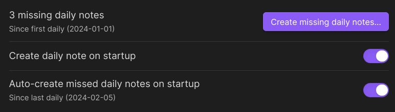
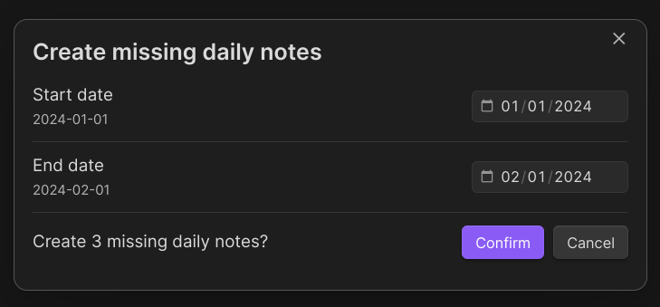

# Daily note creator

Do you want [Obsidian](https://obsidian.md/) to create your [daily notes](https://help.obsidian.md/Plugins/Daily+notes) automatically, without opening the daily note on startup, and including days that you haven't opened the vault? Then this is the plugin for you!

It acts as an alternative to [Auto Journal](https://github.com/Ebonsignori/obsidian-auto-journal). Auto Journal also has backfill functionality and comes with more features such as monthly notes, but also enforces a certain folder structure.

Daily note creator is designed to be an add-on to the daily notes core plugin, rather than a replacement, and will use the settings you defined there.

## Features

**Create daily note on startup** lets you disable the built-in `open daily note on startup` option. This is useful if you want to open the vault on your last open note, or your homepage.

**Auto-create missed daily notes on startup** will fill in daily notes for days that you didn't open the vault. If this is more than a week, it will ask for confirmation.

**Create missing daily notes** is a command you can trigger anytime to open a pop-up window that lets you fill in missed notes for any range of time. Use this if you want to fill in some missing days in the past.

